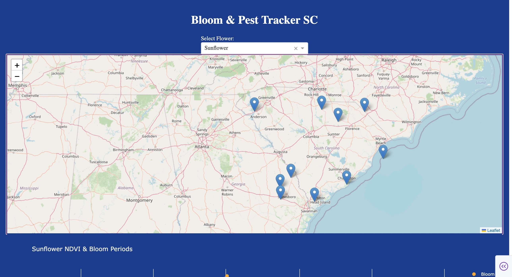

<!DOCTYPE html>
<html lang="en">
<head>
<meta charset="UTF-8">
<meta name="viewport" content="width=device-width, initial-scale=1.0">
<title>My Projects</title>

</head>

<body>

<!-- Hero -->
<header class="hero">
    <h1>My Projects 👩🏻‍💻</h1>
    
Click a project to preview it

</header>

<!-- Projects -->
<section class="projects" id="projects">
    

        <!-- Image Preview Card -->
        

            <h3>Palmetto Blooms – Hackathon Project</h3>
            
Mobile app that identifies bloom stages and flags early pest risks.

            

                
            

        

        <!-- Video Preview Card -->
        

            <h3>Skincare App – Personalized Routine Tracker</h3>
            
Quiz-based skin type assessment with routine tracking.

        

        <!-- Video Modal -->
        

            

                &times;
                <iframe 
                    src="https://drive.google.com/file/d/1FFjCQ3m7rX0kWM5FWfWl19ulW7juxcR3/preview"
                    width="100%" 
                    height="400"
                    allowfullscreen>
                </iframe>
            

        

        <!-- More Image Preview Cards -->
        

            <h3>Gender Gap in Computer Science</h3>
            
Analyzed 10+ years of IPEDS data to visualize enrollment trends.

            

                
            

        

        

            <h3>Weather Prediction (Python)</h3>
            
Machine learning models trained on 100 years of weather data.

            

                
            

        

    

</section>

<!-- Footer -->
<footer class="footer">
    
Last updated 2025 by DianaBear | Clemson University

    

        <a href="index.html">Home</a> |
        <a href="about.html">About</a> |
        <a href="CareerOverview.html">Career</a> |
        <a href="Resume.html">Resume</a>
    

</footer>

<!-- JS -->

</body>
</html>
